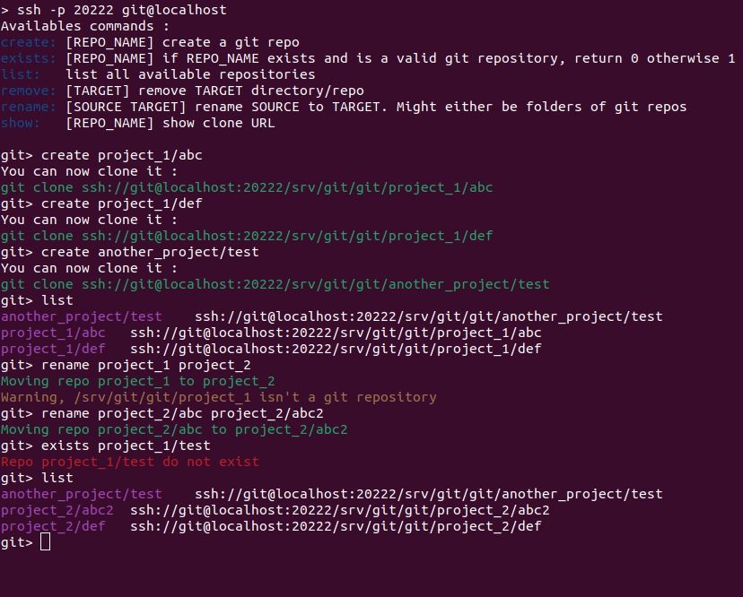

# minimal-git-server
[](https://opensource.org/licenses/MIT)
[](https://github.com/mcarbonne/minimal-git-server/tags)
[](https://github.com/mcarbonne/minimal-git-server)

Originally inspired by https://github.com/jkarlosb/git-server-docker

This container lets you run a minimal git server with a basic CLI to manage repositories, supporting multiple accounts.

## Versioning and packaging
This tool follows [semantic versioning](https://semver.org/).

Pre-built images are available on github packages:
- `ghcr.io/mcarbonne/minimal-git-server:main` (`main` branch)
- `ghcr.io/mcarbonne/minimal-git-server:latest`: latest tagged version
- `ghcr.io/mcarbonne/minimal-git-server:x.x.x`
- `ghcr.io/mcarbonne/minimal-git-server:x.x`
- `ghcr.io/mcarbonne/minimal-git-server:x`

When using automatic updates ([watchtower](https://github.com/containrrr/watchtower), [podman-auto-update](https://docs.podman.io/en/latest/markdown/podman-auto-update.1.html)...), using the lastest major tag available (`ghcr.io/mcarbonne/minimal-git-server:2`) is recommanded to avoid breaking changes.

## Features
- support multiple accounts (config.yml)
- basic CLI to manage repositories (list/create/rename/remove/...)
- easy to use in scripts
- tested on docker and podman

## Minimal configuration

This container requires 3 volumes in order to work:
- `/srv/ssh` to persist generated server keys
- `/srv/git` to store repositories
- `/srv/config.yml` to set up accounts, allowed public keys...

```
docker run -v .../ssh:/srv/ssh -v .../git:/srv/git -v .../config.yml:/srv/config.yml:ro \
        --name minimal-git-server -d -p 20222:22 ghcr.io/mcarbonne/minimal-git-server:2
```


## config.yml

```yaml
external_hostname: localhost
external_port: 20222
accounts:
  - user: user_a
    id: 12345
    keys:
      - "ssh-rsa XXXXXX user_a@gmail.com"
      - "ssh-rsa XXXXXX user_a@hotmail.com"
  - user: user_b
[...]
```


## Basic Usage
To manage your repositories, simply log in:


## How to script ?
You can easily embed any supported command in your scripts:
```console
$ ssh ACCOUNT@HOSTNAME -p PORT create project1/my_repo
```
Have a look at `test.sh` for more examples.
